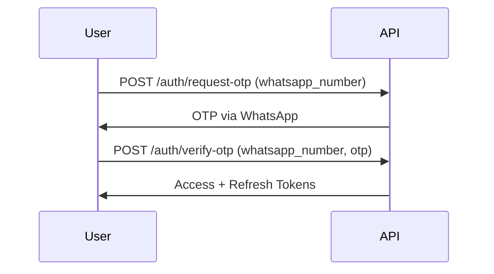

# UAT Tool API Documentation

[](https://yourapi.statuspage.io)
[](http://localhost:8000/api/schema/)
[]()

A comprehensive User Acceptance Testing management system API with WhatsApp-based OTP authentication.

## Table of Contents

- [Interactive Documentation](#interactive-documentation)
- [Authentication](#authentication)
  - [JWT + OTP Flow](#jwt--otp-flow)
  - [Authentication Endpoints](#authentication-endpoints)
- [API Endpoints](#api-endpoints)
  - [Organizations](#organizations)
  - [Users](#users)
  - [Systems](#systems)
  - [Functionalities](#functionalities)
  - [Test Cases](#test-cases)
  - [Test Steps](#test-steps)
  - [Test Executions](#test-executions)
  - [Defects](#defects)
- [Data Schemas](#data-schemas)
  - [User Schema](#user-schema)
  - [Test Case Schema](#test-case-schema)
- [Examples](#examples)
  - [User Registration](#user-registration)
  - [Create Test Execution](#create-test-execution)
- [Error Handling](#error-handling)
- [Development Setup](#development-setup)

## Interactive Documentation

Explore our live API documentation using Swagger UI:  
`http://localhost:8000/api/docs/`

[](http://localhost:8000/api/docs/)

**Features:**

- Live endpoint testing
- Model schemas visualization
- Direct API requests from browser
- Authentication configuration

Access raw OpenAPI schema:  
`http://localhost:8000/api/schema/`

## Authentication

### JWT + OTP Flow



### Authentication Endpoints

| Endpoint                 | Method | Description                         |
|--------------------------|--------|-------------------------------------|
| `/auth/register/`        | POST   | Register new user                  |
| `/auth/request-otp/`     | POST   | Send OTP to WhatsApp number        |
| `/auth/verify-otp/`      | POST   | Verify OTP and get tokens          |
| `/auth/refresh-token/`   | POST   | Refresh access token               |
| `/auth/staff-token/`     | POST   | Admin access token (staff only)    |

## API Endpoints

### Organizations

| Endpoint                  | Method | Description             |
|---------------------------|--------|-------------------------|
| `/organizations/`         | GET    | List all organizations  |
| `/organizations/`         | POST   | Create new organization |
| `/organizations/{id}/`    | GET    | Get organization details |
| `/organizations/{id}/`    | PUT    | Update organization      |
| `/organizations/{id}/`    | DELETE | Delete organization      |

### Users

| Endpoint           | Method | Description                 |
|--------------------|--------|-----------------------------|
| `/users/`         | GET    | List users (admin only)     |
| `/users/`         | POST   | Create user (admin only)    |
| `/users/{id}/`    | GET    | Get user details           |
| `/users/{id}/`    | PUT    | Update user                |
| `/users/{id}/`    | DELETE | Delete user (admin only)   |

### Systems

| Endpoint         | Method | Description        |
|------------------|--------|--------------------|
| `/systems/`     | GET    | List systems      |
| `/systems/`     | POST   | Create system     |
| `/systems/{id}/` | GET    | Get system details |
| `/systems/{id}/` | PUT    | Update system     |
| `/systems/{id}/` | DELETE | Delete system     |

### Functionalities

| Endpoint                | Method | Description             |
|-------------------------|--------|-------------------------|
| `/functionalities/`     | GET    | List functionalities    |
| `/functionalities/`     | POST   | Create functionality    |
| `/functionalities/{id}/` | GET    | Get functionality details |
| `/functionalities/{id}/` | PUT    | Update functionality    |
| `/functionalities/{id}/` | DELETE | Delete functionality    |

### Test Cases

| Endpoint          | Method | Description          |
|-------------------|--------|----------------------|
| `/test-cases/`   | GET    | List test cases     |
| `/test-cases/`   | POST   | Create test case    |
| `/test-cases/{id}/` | GET    | Get test case details |
| `/test-cases/{id}/` | PUT    | Update test case    |
| `/test-cases/{id}/` | DELETE | Delete test case    |

### Test Executions

| Endpoint              | Method | Description          |
|-----------------------|--------|----------------------|
| `/test-executions/`   | GET    | List test executions |
| `/test-executions/`   | POST   | Create test execution |
| `/test-executions/{id}/` | GET    | Get execution details |
| `/test-executions/{id}/` | PUT    | Update execution     |
| `/test-executions/{id}/` | DELETE | Delete execution     |

**Status Options:** `in_progress`, `passed`, `failed`, `blocked`

### Defects

| Endpoint      | Method | Description      |
|--------------|--------|------------------|
| `/defects/`  | GET    | List defects     |
| `/defects/`  | POST   | Create defect    |
| `/defects/{id}/` | GET    | Get defect details |
| `/defects/{id}/` | PUT    | Update defect    |
| `/defects/{id}/` | DELETE | Delete defect    |

**Severity Levels:** `low`, `medium`, `high`, `critical`

## Data Schemas

### User Schema

```json
{
  "id": "UUID",
  "whatsapp_number": "+1234567890",
  "organization": "UUID",
  "role": "admin/tester/viewer",
  "is_active": true,
  "first_name": "John",
  "created_at": "2024-03-15T12:00:00Z"
}
```

### Test Case Schema

```json
{
  "id": "UUID",
  "title": "Login Functionality",
  "functionality": "UUID",
  "description": "Test user login flow",
  "expected_result": "Successful authentication",
  "created_by": "UUID",
  "steps": [
    {
      "step_number": 1,
      "description": "Enter valid credentials",
      "expected_result": "Login button enabled"
    }
  ]
}
```

## Examples

### User Registration

```bash
curl -X POST http://localhost:8000/api/auth/register/ \
-H "Content-Type: application/json" \
-d '{
  "whatsapp_number": "+1234567890",
  "password": "SecurePass123!",
  "first_name": "Alice",
  "organization": "org-uuid-here"
}'
```

### Create Test Execution

```bash
curl -X POST http://localhost:8000/api/test-executions/ \
-H "Authorization: Bearer YOUR_JWT" \
-H "Content-Type: application/json" \
-d '{
  "test_case": "testcase-uuid"
}'
```

